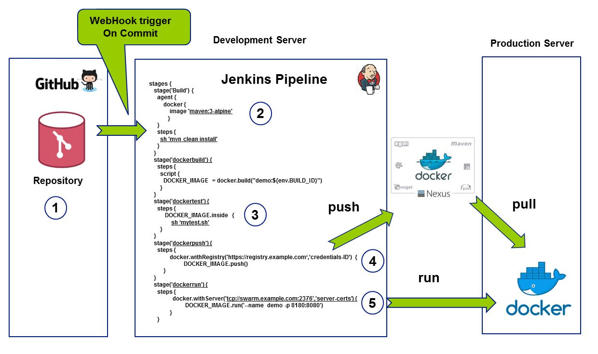

# The beauty of Jenkins Pipelines and Docker, simply all you need

Just one of these tutorials to run jenkins pipelines on blueocean in Docker containers. Just to show how easy things can be. No need for proprietary solutions like OpenShift together with S2I.

* Jenkins Pipelines and Groovy
* Jenkins [Docker agents](https://jenkins.io/doc/book/pipeline/docker/) 
* Plain Docker and Docker compose 
* Blue ocean, [read this great stuff](https://jenkins.io/doc/tutorials/create-a-pipeline-in-blue-ocean/)

The everlasting discussion, do we need Docker container management and clustering solutions to do our development work, the answer is a definite NO... Most of you are probably fimiliair with XP and [YAGNI](https://en.wikipedia.org/wiki/You_aren%27t_gonna_need_it), get away from all the redundancy and do the following...

Just take a Linux VM, put docker on it, see that you get a company private central Docker registry like [NEXUS 3](http://books.sonatype.com/nexus-book/3.0/reference/docker.html) and run all your CI/CD builds with Jenkins Pipelines.
And if, you want to deploy your containers to productive environments and you look for a solid solution for tracking your pipelines on JIRA tickets have a look at the beautiful JIRA integration library for Jenkins Pipelines, read [JIRA pipeline steps](https://jenkinsci.github.io/jira-steps-plugin/index.html). Its all free to get and backed up by a hudge community effort and experience.


No need for OpenShift build configs and S2I builder images, all overhead, simply rely on Jenkins Pipeline agents and read [Running Maven from Pipelines](https://jenkins.io/doc/book/pipeline/docker/)

## proposal DevOps with Jenkins Pipelines & Docker
Picture explains how to build, test, package on one Linux box running Jenkins as a container and pull and run docker containers on a Production Linux box from one pipeline.

1. Commit on the master branch of your repo triggers remote Jenkins Pipeline through webhooks trigger.
2. Jenkins pipeline clones git repo, maven builds your application with Docker Agent running maven 3 alpine image (service container)
3. Jenkins test pipeline stage runs some tests on the image you just produced with the docker buildfile on your git repository
4. Docker push your image on the Docker Hub
5. Docker remote run and pull the image from the central Docker Hub registry

## Run Docker in Container

Bind host Docker sockets into your jenkins blueocean container.
read [Jenkins in Container](https://jenkins.io/doc/tutorials/create-a-pipeline-in-blue-ocean/)

## Play with Docker
Go to PWD Docker Playground and play around with Jenkins on Docker from interactive [play with docker](https://labs.play-with-docker.com/)

## Run jenkins in container and bind host docker

* create directory /jenkins
* docker run -d --name jenkins --user root -p 8080:8080 -v /jenkins:/var/jenkins_home -v /var/run/docker.sock:/var/run/docker.sock jenkinsci/blueocean
* docker logs -f jenkins
* docker exec -ti jenkins bash
* docker ps -a
* browse to http://localhost:8080 and wait until the Unlock Jenkins page appears.
* get password from /jenkins/secrets/initialAdminPassword


## assemble test environment
* docker run -d --name jdo -p 8080:8080 katacodarob/jdo
* docker run -d --name jenkins --user root -p 8081:8080 -v /jenkins:/var/jenkins_home -v /var/run/docker.sock:/var/run/docker.sock jenkinsci/blueocean
* docker network create demo
* docker network connect --alias jdo demo jdo
* docker network connect --alias jenkins demo jenkins
## Maven M2 cache and Docker data volume containers
Docker volume containers is a elegant way of sharing the M2 maven cache between multiple containers in a host-independent way. 
This is how you would like to run our Maven build from a Jenkins Pipeline with docker agent to keep your Maven cache on Jenkins
```groovy
    stage('Build') {
      agent {
          docker {
              image 'maven:3-alpine'
            // do some caching on maven here
              args '-v $HOME/.m2:/root/.m2'
          }
      }
      steps {
        sh 'mvn clean install'
      }
    }
```
### this is how you should do this with data volumes
First create your data volume container like this...
```
docker create --name=jenkins-data katacoda/jenkins-data
```
```groovy
    stage('Build') {
      agent {
          docker {
              image 'maven:3-alpine'
            // do some caching on maven here
              args '--volumnes-from=jenkins-data'
          }
      }
      steps {
        sh 'mvn clean install'
      }
    }
```
## some great reads
* https://getintodevops.com/blog/building-your-first-docker-image-with-jenkins-2-guide-for-developers
* https://damnhandy.com/2016/03/06/creating-containerized-build-environments-with-the-jenkins-pipeline-plugin-and-docker-well-almost/
* [Docker Data Containers and Named Volumes](https://boxboat.com/2016/06/18/docker-data-containers-and-named-volumes/)
## share standard pipelines accross mutliple projects
* [pipelines templates](https://jenkins.io/blog/2017/10/02/pipeline-templates-with-shared-libraries/)

